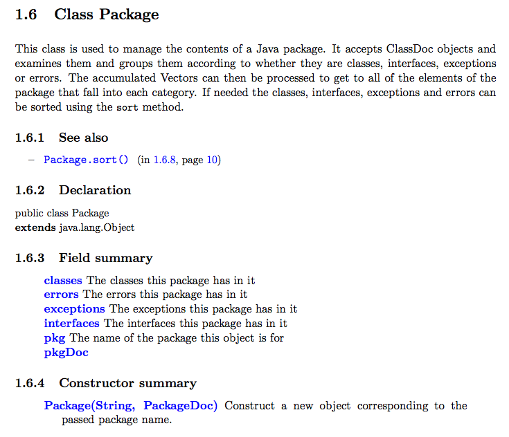
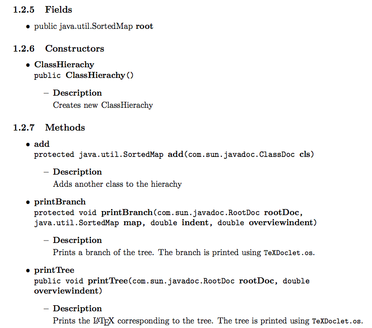

TeXDoclet is a Java doclet implementation that generates a LaTeX file from you Java code documentation.

The doclet is based on the doclet originally created by Greg Wonderly of
[C2 technologies Inc.](http://www.c2-tech.com>) and its revision by Soeren Caspersen of
[XO Software](http://www.xosoftware.dk).

Example outputs
---------------

See the following example PDF documents which are generated by *pdflatex* from *TeXDoclet* LaTeX output :

* report document class example : [TeXDoclet_report.pdf](resources/examples/TeXDoclet_report.pdf)
* article document class example : [TeXDoclet_article.pdf](resources/examples/TeXDoclet_article.pdf)

<link href="css/lightbox.css" rel="stylesheet" />
<link href="css/my_stylesheet.css" rel="stylesheet" />

	
	
	
	
	

Download
--------

### TeXDoclet.jar

[*TeXDoclet.jar*](resources/bin/TeXDoclet.jar) is all you need to create LaTeX file from your Java sources.

### Latest version & Source Code

*Github* project site : <http://github.com/doclet/texdoclet>.

Instead of downloading the Java jar file you can also check out the latest *TeXDoclet* version by cloning the *Git* repository `https://github.com/doclet/texdoclet.git`

    git clone https://github.com/doclet/texdoclet.git

And compile the *TeXDoclet.jar* with maven2 from the project root directory :

	mvn clean install

This generates the *TeXDoclet.jar* file in the `target/` subdirectory.

New - Markdown Support
----------------------

*TeXDoclet* integrates now [Txtmark - Java markdown processor](https://github.com/rjeschke/txtmark). 

Forget about to write your javadoc in HTML ! 
Just simply write [Markdown syntax](http://daringfireball.net/projects/markdown/syntax) like this (and put it in a `<PRE format="md">` HTML tag) :

	<PRE format="md">

	some text some text some text some text some text some text some text 

	##### Lists

	- item1
	    1. item11
	    2. item12
	- item1

	##### Text formatting

	_emphasis_ and __strong__ and some `code` :

	    code line 1
	    code line 2
	    
	some text some text some text some text some text some text some text

	</PRE>

... and you will get the following _pdflatex_ output :

Nothing could be simpler! 

Usage
-----

Generally a Java documentation is created with the *javadoc* tool (and its default doclet) that comes along with the Java JRE/JDK installation. To create a Java documentation with a doclet other than the default doclet you have to specify the doclet with the `-docletpath` and `-doclet` parameters of the *javadoc* tool :

	javadoc -docletpath <path to doclet .jar file> -doclet <doclet class name>

According to this you have to set the path to the *TeXDoclet.jar* file and the class name `org.stfm.texdoclet.TeXDoclet` for the *javadoc* use with *TeXDoclet* doclet.

Assuming you have the following project structure :

    <project root dir>
      src
        main
          java
            com
              <subpackages and java code> 
            org
              <subpackages and java code>

Then the following example *javadoc* execution builds Javadoc documentation (in `out.tex`) from Java sources located in `src/main/java` subdirectory for all packages starting with `org` and `com` :

	javadoc -docletpath path/to/TeXDoclet.jar \
		-doclet org.stfm.texdoclet.TeXDoclet \
		-noindex \
		-tree \
		-hyperref \
		-output out.tex \
		-title "My Title" \
		-author "My Name" \
		-sourcepath src/main/java \
		-subpackages org:com

### Example javadoc calls

See `createDocs.sh` scripts in `/examples` [subdirectory](https://github.com/doclet/texdoclet/tree/master/examples) of the github project for more examples.

### TeXDoclet output configuration

*TeXDoclet* doclet is configured by arguments passed to the doclet by the *javadoc* execution. There are a lot of defined parameters to affect the Latex document output. Print help to get a complete list of parameters you can pass to the *TeXDoclet* doclet :

Print help (TeXDoclet + javadoc help) :

	javadoc -docletpath target/TeXDoclet.jar -doclet org.stfm.texdoclet.TeXDoclet

or (TeXDoclet help only) :

	java -jar target/TeXDoclet.jar -h

	-title <title>            A title to use for the generated output document.
	-subtitle <title>         A subtitle for the output document. No -title will result in no title page.
	-output <outfile>         Specifies the output file to write to. If none specified, the default is docs.tex in the current directory.
	-docclass <class>         LaTeX2e document class, `report' is the default.
	-doctype <type>           LaTeX2e document style, `headings' is the default.
	-classfilter <name>       The name of a class implementing the ClassFilter interface.
	-date <date string>       The value to use for the document date.
	-author <author>          Specifies string to use for document Author.
	-texinit <file>           LaTeX2e statements included before \begin{document}.
	-texsetup <file>          LaTeX2e statements included after \begin{document} \maketitle (if title was specified).
	-texintro <file>          LaTeX2e statements included after table of contents
	-texfinish <file>         LaTeX2e statements included before \end{document}.
	-texpackage <file>        LaTeX2e statements included before packages' \chapter.
	-setup <file>             A setup file included before \begin{document}.
	-twosided                 Print twosided.
	-serial                   Do print Serializable information.
	-nosummaries              Do print summaries of fiels, constructors and methods.
	-nofieldsummary           Do not print field summaries
	-noconstructorsummary     Do not print constructor summaries
	-noinherited              Do not include inherited API information in output.
	-shortinherited           Prints a short inheritance, only the member name (not the whole signature)
	-noindex                  Do not create index.
	-tree                     Create a class tree.
	-treeindent <float>       Indent <float>cm i the class tree. Default is 1cm.
	-hyperref                 Use the hyperref package.
	-pdfhyperref              Use the hyperref package with pdf. Overrides -hypertex.
	-version                  Includes version-tags .
	-hr                       Prints horizontal rows in the output (to get a better? view).
	-include                  Creates output in two seperated latex documents: one for the preamble part and another for the actual java documentation content.
	-sectionlevel <level>     Specifies the highest level of sections (either "subsection", "section" or "chapter").
	-imagespath               Path to the texdoclet_images dir (absolute or relative to the output document .tex file).
	-tablescale <factor>      Scale factor to specify width of tables. Default value is 0.9.

### How to use generated LaTeX documentation in your own document

If you want to use TeXDoclet output in your own LaTeX document, simply use option `-include`. Option `-include` produces two .tex files that you have to insert in your LaTeX document (for instance by using the `\input{}` LaTeX command) : 

- TeXDoclet_preamble.tex : to include in the preamble part of your LaTeX document.
- TeXDoclet.tex : this is the actual java documentation content that you can place wherever you want between `\begin{document}` and `\end{document}` in your LaTeX document. 

See example 4 in the `/examples/example4_include` [subdirectory](https://github.com/doclet/texdoclet/tree/master/examples/example4_include) of the github project for more info.

Previous versions
-----------------

- The intitial project of Greg Wonderly is available here : <http://java.net/projects/texdoclet>.
- Its [revision](http://egee-jra1-integration.web.cern.ch/egee-jra1-integration/repository/texdoclet/1.3/share/README.txt) by Soeren Caspersen you find here : <http://egee-jra1-integration.web.cern.ch/egee-jra1-integration/repository/texdoclet>.

